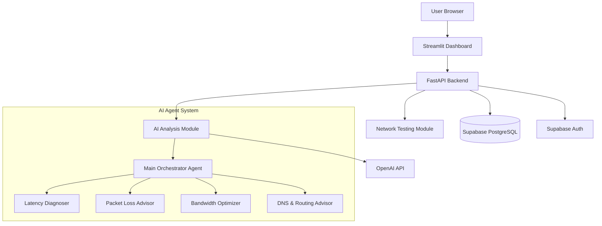

# Design Document

## Overview

The AI Network Analyzer & Optimization Agent is a modular, full-stack SaaS platform built with Python. The architecture follows a clean separation of concerns with distinct layers for network testing, AI analysis, API services, data persistence, and user interface. The system leverages Supabase for authentication and database management, OpenAI Agent SDK for intelligent analysis, and Streamlit for an interactive dashboard.

### Key Design Principles

- **Modularity**: Each component (network testing, AI analysis, API, UI) is independently maintainable
- **Scalability**: Stateless API design enables horizontal scaling
- **Security**: Authentication at every layer, secure credential management
- **Extensibility**: Plugin-style architecture for adding new network tests or AI agents
- **Observability**: Comprehensive logging and error tracking throughout

## Architecture

### High-Level Architecture



### Technology Stack

- **Frontend**: Streamlit 1.28+ (Python-based web framework)
- **Backend API**: FastAPI 0.104+ with Pydantic for validation
- **Network Testing**: Scapy, Ping3, Speedtest-CLI, dnspython
- **AI Layer**: OpenAI Python SDK with Agent framework
- **Database**: Supabase (PostgreSQL 15+)
- **Authentication**: Supabase Auth with JWT tokens
- **Deployment**: Render (backend), Streamlit Cloud (frontend option)
- **CI/CD**: GitHub Actions

### Project Structure

```
ai-network-analyzer/
├── .github/
│   └── workflows/
│       └── ci-cd.yml
├── backend/
│   ├── app/
│   │   ├── __init__.py
│   │   ├── main.py                 # FastAPI application entry
│   │   ├── config.py               # Configuration management
│   │   ├── dependencies.py         # Dependency injection
│   │   └── api/
│   │       ├── __init__.py
│   │       ├── routes/
│   │       │   ├── __init__.py
│   │       │   ├── tests.py        # /run-test, /get-results
│   │       │   ├── optimizations.py # /apply-optimization
│   │       │   └── feedback.py     # /feedback
│   │       └── middleware/
│   │           ├── __init__.py
│   │           └── auth.py         # Authentication middleware
│   ├── core/
│   │   ├── __init__.py
│   │   ├── network/
│   │   │   ├── __init__.py
│   │   │   ├── ping_test.py
│   │   │   ├── jitter_test.py
│   │   │   ├── packet_loss_test.py
│   │   │   ├── speed_test.py
│   │   │   ├── dns_test.py
│   │   │   └── test_runner.py      # Orchestrates all tests
│   │   ├── ai/
│   │   │   ├── __init__.py
│   │   │   ├── main_agent.py       # Main orchestrator
│   │   │   ├── agents/
│   │   │   │   ├── __init__.py
│   │   │   │   ├── latency_diagnoser.py
│   │   │   │   ├── packet_loss_advisor.py
│   │   │   │   ├── bandwidth_optimizer.py
│   │   │   │   └── dns_routing_advisor.py
│   │   │   └── prompts.py          # Agent prompts and templates
│   │   └── database/
│   │       ├── __init__.py
│   │       ├── client.py           # Supabase client
│   │       ├── models.py           # Pydantic models
│   │       └── repositories/
│   │           ├── __init__.py
│   │           ├── user_repository.py
│   │           ├── test_repository.py
│   │           ├── recommendation_repository.py
│   │           ├── optimization_repository.py
│   │           └── feedback_repository.py
│   ├── tests/
│   │   ├── __init__.py
│   │   ├── test_network_module.py
│   │   ├── test_ai_module.py
│   │   └── test_api_endpoints.py
│   ├── requirements.txt
│   └── README.md
├── frontend/
│   ├── app.py                      # Main Streamlit application
│   ├── components/
│   │   ├── __init__.py
│   │   ├── auth.py                 # Login/signup components
│   │   ├── test_runner.py          # Test initiation UI
│   │   ├── results_display.py      # Results visualization
│   │   ├── recommendations.py      # AI insights display
│   │   └── charts.py               # Chart components
│   ├── utils/
│   │   ├── __init__.py
│   │   ├── api_client.py           # Backend API client
│   │   └── session.py              # Session management
│   ├── requirements.txt
│   └── README.md
├── database/
│   ├── schema.sql                  # Database schema
│   └── migrations/
│       └── initial_setup.sql
├── .env.example
├── .gitignore
├── README.md
└── docker-compose.yml              # Local development setup
```

## Components and Interfaces

### 1. Network Testing Module

**Purpose**: Execute network performance tests and return structured results.

**Components**:

- **PingTest**: Measures latency to target hosts
  - Uses `ping3` library for ICMP ping
  - Sends 10 packets, calculates min/max/avg/stddev
  - Returns: `{host, packets_sent, packets_received, min_ms, max_ms, avg_ms, stddev_ms}`

- **JitterTest**: Calculates variation in latency
  - Performs consecutive pings
  - Calculates absolute differences between consecutive measurements
  - Returns: `{avg_jitter_ms, max_jitter_ms}`

- **PacketLossTest**: Measures packet loss percentage
  - Sends 100 packets using `scapy`
  - Tracks successful responses
  - Returns: `{packets_sent, packets_received, loss_percentage}`

- **SpeedTest**: Measures bandwidth
  - Uses `speedtest-cli` library
  - Tests upload and download speeds
  - Returns: `{download_mbps, upload_mbps, ping_ms, server_location}`

- **DNSTest**: Measures DNS resolution time
  - Uses `dnspython` to query multiple DNS servers
  - Tests common domains (google.com, cloudflare.com, etc.)
  - Returns: `{dns_server, avg_resolution_ms, queries_tested}`

- **TestRunner**: Orchestrates all tests
  - Runs tests in parallel where possible
  - Aggregates results into unified JSON
  - Handles timeouts and errors gracefully

**Interface**:

```python
class NetworkTestRunner:
    async def run_all_tests(self, config: TestConfig) -> NetworkTestResult:
        """
        Executes all network tests based on configuration.
        
        Args:
            config: TestConfig object with target hosts, DNS servers, etc.
            
        Returns:
            NetworkTestResult with all test metrics
            
        Raises:
            NetworkTestException: If critical tests fail
        """
        pass
```

### 2. AI Analysis Module

**Purpose**: Analyze network test results using multiple specialized AI agents and generate actionable recommendations.

**Architecture**: Multi-agent system with a main orchestrator and four specialized sub-agents.

**Components**:

- **MainAgent (Orchestrator)**:
  - Receives network test results
  - Delegates analysis to specialized sub-agents
  - Merges insights from all sub-agents
  - Generates unified recommendation set with confidence scores
  - Prioritizes recommendations by severity and confidence

- **LatencyDiagnoser**:
  - Analyzes ping latency patterns
  - Identifies high latency issues
  - Suggests routing optimizations
  - Confidence based on latency thresholds (>100ms = high confidence)

- **PacketLossAdvisor**:
  - Analyzes packet loss patterns
  - Identifies network stability issues
  - Recommends hardware or ISP investigation
  - Confidence based on loss percentage (>5% = high confidence)

- **BandwidthOptimizer**:
  - Analyzes upload/download speeds
  - Compares against expected ISP speeds
  - Suggests QoS configurations
  - Confidence based on deviation from expected speeds

- **DNSRoutingAdvisor**:
  - Analyzes DNS resolution times
  - Compares different DNS servers
  - Recommends optimal DNS configuration
  - Confidence based on resolution time differences

**Agent Prompts Strategy**:
- Each agent receives structured JSON input
- Prompts include context about normal ranges and thresholds
- Agents return structured JSON with recommendations and confidence scores
- Main agent uses a synthesis prompt to merge insights

**Interface**:

```python
class AIAnalyzer:
    def __init__(self, openai_api_key: str):
        self.main_agent = MainAgent(openai_api_key)
        
    async def analyze(self, test_results: NetworkTestResult) -> AIRecommendations:
        """
        Analyzes network test results using AI agents.
        
        Args:
            test_results: NetworkTestResult from testing module
            
        Returns:
            AIRecommendations with insights and confidence scores
            
        Raises:
            AIAnalysisException: If AI analysis fails
        """
        pass
```

### 3. Database Layer

**Purpose**: Persist all application data with proper relationships and indexing.

**Schema Design**:

```sql
-- Users table (managed by Supabase Auth)
CREATE TABLE users (
    id UUID PRIMARY KEY DEFAULT uuid_generate_v4(),
    email VARCHAR(255) UNIQUE NOT NULL,
    created_at TIMESTAMP DEFAULT NOW(),
    updated_at TIMESTAMP DEFAULT NOW()
);

-- Network tests table
CREATE TABLE network_tests (
    id UUID PRIMARY KEY DEFAULT uuid_generate_v4(),
    user_id UUID NOT NULL REFERENCES users(id) ON DELETE CASCADE,
    test_timestamp TIMESTAMP DEFAULT NOW(),
    ping_results JSONB NOT NULL,
    jitter_results JSONB NOT NULL,
    packet_loss_results JSONB NOT NULL,
    speed_results JSONB NOT NULL,
    dns_results JSONB NOT NULL,
    status VARCHAR(50) DEFAULT 'completed',
    created_at TIMESTAMP DEFAULT NOW(),
    INDEX idx_user_timestamp (user_id, test_timestamp DESC)
);

-- AI recommendations table
CREATE TABLE ai_recommendations (
    id UUID PRIMARY KEY DEFAULT uuid_generate_v4(),
    test_id UUID NOT NULL REFERENCES network_tests(id) ON DELETE CASCADE,
    agent_type VARCHAR(100) NOT NULL,
    recommendation_text TEXT NOT NULL,
    confidence_score DECIMAL(3,2) NOT NULL CHECK (confidence_score >= 0 AND confidence_score <= 1),
    severity VARCHAR(50) NOT NULL,
    created_at TIMESTAMP DEFAULT NOW(),
    INDEX idx_test_id (test_id)
);

-- Optimization history table
CREATE TABLE optimization_history (
    id UUID PRIMARY KEY DEFAULT uuid_generate_v4(),
    user_id UUID NOT NULL REFERENCES users(id) ON DELETE CASCADE,
    recommendation_id UUID NOT NULL REFERENCES ai_recommendations(id) ON DELETE CASCADE,
    action_taken TEXT NOT NULL,
    applied_at TIMESTAMP DEFAULT NOW(),
    notes TEXT,
    INDEX idx_user_applied (user_id, applied_at DESC)
);

-- Feedback table
CREATE TABLE feedback (
    id UUID PRIMARY KEY DEFAULT uuid_generate_v4(),
    user_id UUID NOT NULL REFERENCES users(id) ON DELETE CASCADE,
    test_id UUID REFERENCES network_tests(id) ON DELETE SET NULL,
    recommendation_id UUID REFERENCES ai_recommendations(id) ON DELETE SET NULL,
    rating INTEGER CHECK (rating >= 1 AND rating <= 5),
    comment TEXT,
    created_at TIMESTAMP DEFAULT NOW(),
    INDEX idx_user_feedback (user_id, created_at DESC)
);
```

**Repository Pattern**:
Each table has a dedicated repository class with CRUD operations:

```python
class TestRepository:
    def __init__(self, supabase_client):
        self.client = supabase_client
        
    async def create_test(self, user_id: str, test_data: dict) -> str:
        """Creates a new network test record."""
        pass
        
    async def get_user_tests(self, user_id: str, limit: int = 10) -> List[dict]:
        """Retrieves user's test history."""
        pass
```

### 4. Backend API (FastAPI)

**Purpose**: Provide RESTful API endpoints for frontend communication.

**Endpoints**:

**POST /api/v1/run-test**
- Request: `{target_hosts: [], dns_servers: []}`
- Response: `{test_id: UUID, status: "running"}`
- Initiates async network test
- Returns immediately with test ID

**GET /api/v1/get-results/{test_id}**
- Response: `{test_results: {}, ai_recommendations: [], status: "completed"}`
- Retrieves test results and AI analysis
- Polls until test completes

**POST /api/v1/apply-optimization**
- Request: `{recommendation_id: UUID, action_taken: string, notes: string}`
- Response: `{optimization_id: UUID, success: true}`
- Records optimization action

**POST /api/v1/feedback**
- Request: `{test_id: UUID, recommendation_id: UUID, rating: int, comment: string}`
- Response: `{feedback_id: UUID, success: true}`
- Stores user feedback

**Authentication Middleware**:
- Validates Supabase JWT tokens on all protected endpoints
- Extracts user_id from token
- Injects user context into request

**Error Handling**:
- Custom exception handlers for different error types
- Structured error responses: `{error: string, detail: string, code: int}`
- Logging of all errors with request context

### 5. Frontend Dashboard (Streamlit)

**Purpose**: Provide interactive UI for users to run tests and view results.

**Page Structure**:

**Login/Signup Page**:
- Supabase Auth integration
- Email/password authentication
- Session token storage in Streamlit session state

**Main Dashboard**:
- Header with user info and logout button
- "Run Network Test" button (prominent)
- Configuration options (target hosts, DNS servers)
- Progress indicator during test execution

**Results Display**:
- Tabs for different metric categories
- **Latency Tab**: Line chart showing ping over time
- **Jitter Tab**: Bar chart of jitter measurements
- **Speed Tab**: Gauge charts for upload/download speeds
- **Packet Loss Tab**: Percentage indicator with color coding
- **DNS Tab**: Comparison chart of DNS server performance

**AI Recommendations Section**:
- Card-based layout for each recommendation
- Confidence score visualization (progress bar or badge)
- Severity indicator (color-coded)
- "Apply Optimization" button per recommendation
- Expandable details section

**History View**:
- Table of past tests with timestamps
- Click to view historical results
- Filter by date range

**Component Design**:
```python
def render_test_runner():
    """Renders the test initiation UI component."""
    pass

def render_results_charts(test_data: dict):
    """Renders visualization charts for test results."""
    pass

def render_recommendations(recommendations: List[dict]):
    """Renders AI recommendation cards with actions."""
    pass
```

## Data Models

### Pydantic Models for API Validation

```python
from pydantic import BaseModel, Field
from typing import List, Optional
from datetime import datetime

class TestConfig(BaseModel):
    target_hosts: List[str] = Field(default=["8.8.8.8", "1.1.1.1"])
    dns_servers: List[str] = Field(default=["8.8.8.8", "1.1.1.1"])
    packet_count: int = Field(default=100, ge=10, le=1000)

class PingResult(BaseModel):
    host: str
    packets_sent: int
    packets_received: int
    min_ms: float
    max_ms: float
    avg_ms: float
    stddev_ms: float

class NetworkTestResult(BaseModel):
    test_id: str
    timestamp: datetime
    ping_results: List[PingResult]
    jitter_avg_ms: float
    jitter_max_ms: float
    packet_loss_percentage: float
    download_mbps: float
    upload_mbps: float
    dns_results: List[dict]
    status: str

class AIRecommendation(BaseModel):
    id: str
    agent_type: str
    recommendation_text: str
    confidence_score: float = Field(ge=0.0, le=1.0)
    severity: str
    created_at: datetime

class OptimizationAction(BaseModel):
    recommendation_id: str
    action_taken: str
    notes: Optional[str] = None
```

## Error Handling

### Error Categories

1. **Network Test Errors**:
   - Timeout errors (host unreachable)
   - Permission errors (requires admin for some tests)
   - Invalid configuration errors

2. **AI Analysis Errors**:
   - OpenAI API rate limits
   - Invalid response format
   - API key issues

3. **Database Errors**:
   - Connection failures
   - Constraint violations
   - Query timeouts

4. **Authentication Errors**:
   - Invalid tokens
   - Expired sessions
   - Unauthorized access

### Error Handling Strategy

```python
# Custom exception hierarchy
class NetworkAnalyzerException(Exception):
    """Base exception for all application errors."""
    pass

class NetworkTestException(NetworkAnalyzerException):
    """Raised when network tests fail."""
    pass

class AIAnalysisException(NetworkAnalyzerException):
    """Raised when AI analysis fails."""
    pass

# Graceful degradation
try:
    ai_recommendations = await ai_analyzer.analyze(test_results)
except AIAnalysisException as e:
    logger.error(f"AI analysis failed: {e}")
    ai_recommendations = generate_fallback_recommendations(test_results)
```

### Logging Strategy

- **Structured logging** using Python's `logging` module
- **Log levels**: DEBUG (development), INFO (production), ERROR (always)
- **Log context**: user_id, test_id, request_id for tracing
- **Log aggregation**: Send logs to external service (e.g., Sentry, LogDNA)

## Testing Strategy

### Unit Tests

**Network Module Tests**:
- Mock network calls to test logic without actual network requests
- Test edge cases (100% packet loss, zero latency, etc.)
- Verify JSON output format

**AI Module Tests**:
- Mock OpenAI API responses
- Test agent orchestration logic
- Verify confidence score calculations

**API Tests**:
- Test each endpoint with valid/invalid inputs
- Verify authentication middleware
- Test error responses

### Integration Tests

**End-to-End Workflow**:
1. Create test user
2. Run network test
3. Verify AI analysis triggered
4. Check database records created
5. Apply optimization
6. Submit feedback

**Database Integration**:
- Test repository CRUD operations
- Verify referential integrity
- Test transaction rollbacks

### Test Coverage Goals

- Minimum 80% code coverage for core modules
- 100% coverage for critical paths (authentication, data persistence)
- Integration tests for all API endpoints

## Security Considerations

### Authentication & Authorization

- JWT tokens with short expiration (1 hour)
- Refresh token mechanism for session extension
- Row-level security in Supabase (users can only access their own data)

### Data Protection

- Environment variables for all secrets
- No hardcoded credentials
- HTTPS only for all communications
- Input validation on all API endpoints

### API Security

- Rate limiting (100 requests/minute per user)
- CORS configuration (whitelist frontend domains)
- SQL injection prevention (parameterized queries)
- XSS prevention (input sanitization)

## Scalability Considerations

### Horizontal Scaling

- Stateless API design (no server-side sessions)
- Load balancer compatible
- Database connection pooling

### Performance Optimization

- Async/await for I/O operations
- Caching of AI recommendations (Redis future enhancement)
- Database indexing on frequently queried columns
- Pagination for large result sets

### Cost Management

- OpenAI API rate limiting
- Database query optimization
- Efficient JSON storage (JSONB in PostgreSQL)

## Deployment Architecture

### Render Deployment

**Backend Service**:
- Docker container with FastAPI app
- Environment variables from Render dashboard
- Auto-deploy on git push to main branch
- Health check endpoint: `/health`

**Environment Variables**:
```
SUPABASE_URL=https://xxx.supabase.co
SUPABASE_KEY=xxx
OPENAI_API_KEY=xxx
DATABASE_URL=postgresql://xxx
ENVIRONMENT=production
LOG_LEVEL=INFO
```

### CI/CD Pipeline

**GitHub Actions Workflow**:
1. Trigger on push to main branch
2. Run linting (flake8, black)
3. Run unit tests
4. Run integration tests
5. Build Docker image
6. Deploy to Render (if tests pass)
7. Run smoke tests on production

### Monitoring & Observability

- Health check endpoint for uptime monitoring
- Application logs sent to logging service
- Error tracking with Sentry
- Performance metrics (response times, error rates)

## Future Enhancements (SaaS Features)

### User Tiers

- Free tier: 10 tests/month
- Pro tier: Unlimited tests, historical analytics
- Enterprise tier: Custom integrations, dedicated support

### Advanced Analytics

- Trend analysis over time
- Comparative reports
- Scheduled automated tests
- Email alerts for degraded performance

### Additional Features

- Mobile app (React Native)
- API for third-party integrations
- Custom AI agent training on user data
- Multi-location testing (distributed test nodes)
