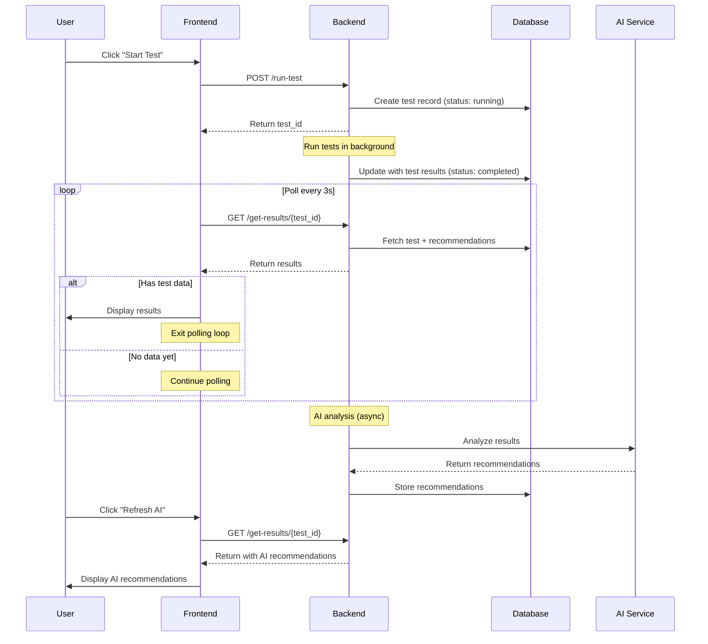
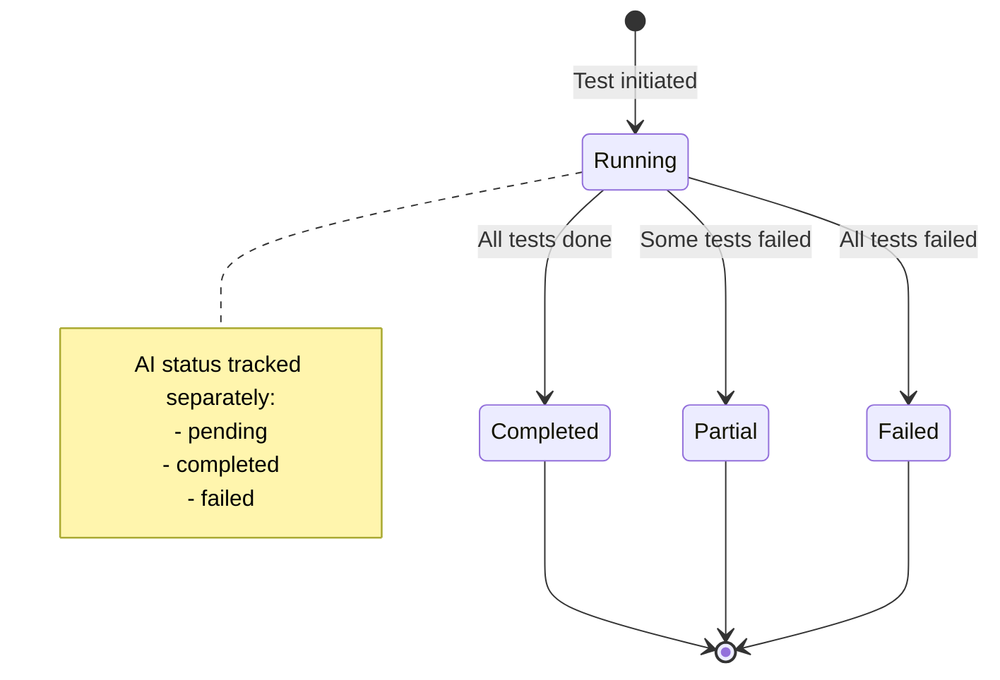

# Design Document

## Overview

This design addresses the issue where network tests complete successfully in the backend but results fail to display on the frontend. The solution involves improving the frontend polling logic, decoupling test results from AI recommendations, and implementing better status checking mechanisms.

## Architecture

### Current Flow (Problematic)
```
User clicks "Start Test"
  → Backend starts test
  → Frontend polls every 3s
  → Frontend checks: status == "completed" AND has_ai_recommendations
  → If both true: display results
  → If timeout (5 min): show error
```

### New Flow (Improved)
```
User clicks "Start Test"
  → Backend starts test
  → Frontend polls every 3s
  → Frontend checks: has_test_data (ping/speed/dns/etc.)
  → If has_test_data: display results immediately
  → Show AI recommendations when available (async)
  → If timeout (5 min): display partial results with refresh option
```

## Components and Interfaces

### 1. Frontend Polling Logic (frontend/app.py)

**Current Issues:**
- Requires both `status == "completed"` AND `has_ai_recommendations`
- Doesn't check for actual test data presence
- Stops polling after 5 minutes even if data exists

**Design Changes:**

```python
# New polling logic
def check_results_ready(results):
    """
    Check if results are ready to display.
    Returns: (ready: bool, has_data: bool, has_ai: bool)
    """
    test_data = results.get('test_results', {})
    
    # Check for ANY test data
    has_data = (
        test_data.get('ping_results') or
        test_data.get('speed_results') or
        test_data.get('packet_loss_results') or
        test_data.get('dns_results') or
        test_data.get('jitter_results')
    )
    
    # Check for AI recommendations (optional)
    ai_recs = results.get('ai_recommendations', [])
    has_ai = ai_recs and len(ai_recs) > 0
    
    # Ready if we have data, regardless of AI status
    ready = has_data
    
    return ready, has_data, has_ai
```

**Polling Loop Changes:**
- Continue polling until `has_data == True` OR timeout
- Display results as soon as `has_data == True`
- Show AI recommendations section separately (can load async)
- After timeout, check one final time and display whatever is available

### 2. Results Display Component (frontend/app.py)

**Current Issues:**
- All-or-nothing display (requires complete results)
- No indication of what's missing
- No way to refresh AI recommendations separately

**Design Changes:**

```python
# Separate display sections
def display_results(results):
    # 1. Always show test data if available
    display_test_metrics(results)
    
    # 2. Show AI recommendations section separately
    ai_recs = results.get('ai_recommendations', [])
    if ai_recs:
        display_ai_recommendations(ai_recs)
    else:
        # Show placeholder with refresh option
        display_ai_pending_message()
        show_refresh_ai_button()
    
    # 3. Show status indicators
    display_test_status_badges(results)
```

**New UI Components:**
- "AI Analysis Pending" card when recommendations aren't ready
- "Refresh AI Recommendations" button
- Individual test status badges (success/failed/skipped)
- Partial results indicator

### 3. Backend Response Structure (backend/app/api/routes/tests.py)

**Current Issues:**
- Response structure doesn't clearly indicate data availability
- Status field is ambiguous

**Design Changes:**

```python
# Enhanced response model
class TestResultsResponse(BaseModel):
    test_results: NetworkTestResult
    ai_recommendations: List[AIRecommendation]
    status: TestStatus
    data_availability: Dict[str, bool]  # NEW
    ai_status: str  # NEW: "completed", "pending", "failed"
    
# Example response
{
    "test_results": {...},
    "ai_recommendations": [...],
    "status": "completed",
    "data_availability": {  # NEW
        "ping": true,
        "speed": true,
        "packet_loss": true,
        "dns": true,
        "jitter": false
    },
    "ai_status": "pending"  # NEW
}
```

### 4. AI Recommendation Generation (backend/core/ai/__init__.py)

**Current Issues:**
- AI generation blocks test completion
- No fallback if AI fails
- No way to retry AI generation separately

**Design Changes:**

**Decouple AI from Test Completion:**
- Test status = "completed" when tests finish
- AI status tracked separately
- Frontend can request AI regeneration

**Add Fallback Recommendations:**
```python
def generate_fallback_recommendations(test_results):
    """Generate basic recommendations based on thresholds."""
    recommendations = []
    
    # Speed-based recommendations
    if test_results.get('speed_results'):
        speed = test_results['speed_results']
        if speed['download_mbps'] < 25:
            recommendations.append({
                "text": "Your download speed is below 25 Mbps. Consider upgrading your internet plan.",
                "severity": "warning",
                "confidence": 0.9
            })
    
    # Latency-based recommendations
    if test_results.get('ping_results'):
        avg_ping = sum(p['avg_ms'] for p in test_results['ping_results']) / len(test_results['ping_results'])
        if avg_ping > 100:
            recommendations.append({
                "text": "High latency detected. Check for network congestion or distance to servers.",
                "severity": "warning",
                "confidence": 0.85
            })
    
    return recommendations
```

## Data Models

### Enhanced TestResultsResponse

```python
class DataAvailability(BaseModel):
    """Indicates which test data is available."""
    ping: bool = False
    jitter: bool = False
    packet_loss: bool = False
    speed: bool = False
    dns: bool = False

class AIStatus(str, Enum):
    """AI recommendation generation status."""
    PENDING = "pending"
    COMPLETED = "completed"
    FAILED = "failed"
    NOT_REQUESTED = "not_requested"

class TestResultsResponse(BaseModel):
    """Enhanced response with data availability indicators."""
    test_results: NetworkTestResult
    ai_recommendations: List[AIRecommendation]
    status: TestStatus
    data_availability: DataAvailability
    ai_status: AIStatus
    message: Optional[str] = None  # User-friendly status message
```

## Error Handling

### Frontend Error Handling

**Polling Errors:**
```python
try:
    results = await api_client.get_results(test_id)
    ready, has_data, has_ai = check_results_ready(results)
    
    if ready:
        display_results(results)
        break
    elif attempt > max_attempts:
        # Timeout - display whatever we have
        if has_data:
            display_results(results)
            show_warning("Some data may still be processing")
        else:
            show_error("Test timed out. Use refresh button to check again.")
        break
        
except Exception as e:
    logger.error(f"Polling error: {e}")
    # Continue polling unless it's a fatal error
    if "404" in str(e) or "403" in str(e):
        show_error(f"Cannot access test results: {e}")
        break
```

### Backend Error Handling

**Test Execution Errors:**
```python
# In execute_network_test()
try:
    test_results = await runner.run_all_tests(...)
    
    # Store results immediately
    test_repo.update_test(test_id, {
        "test_results": test_results,
        "status": "completed",
        "data_availability": calculate_availability(test_results)
    })
    
    # Try AI analysis separately
    try:
        ai_results = await ai_analyzer.analyze(test_results)
        rec_repo.bulk_create(ai_results)
        test_repo.update_test(test_id, {"ai_status": "completed"})
    except Exception as ai_error:
        logger.error(f"AI analysis failed: {ai_error}")
        # Use fallback
        fallback_recs = generate_fallback_recommendations(test_results)
        rec_repo.bulk_create(fallback_recs)
        test_repo.update_test(test_id, {"ai_status": "failed"})
        
except Exception as test_error:
    logger.error(f"Test execution failed: {test_error}")
    test_repo.update_test(test_id, {
        "status": "failed",
        "error_message": str(test_error)
    })
```

## Testing Strategy

### Unit Tests

1. **Frontend Polling Logic**
   - Test `check_results_ready()` with various result combinations
   - Test timeout behavior
   - Test error handling during polling

2. **Backend Response Building**
   - Test `data_availability` calculation
   - Test response with missing AI recommendations
   - Test response with partial test results

3. **AI Fallback Generation**
   - Test fallback recommendations for various scenarios
   - Test threshold-based logic
   - Test empty results handling

### Integration Tests

1. **End-to-End Result Display**
   - Start test → Wait for results → Verify display
   - Test with AI recommendations delayed
   - Test with AI recommendations failed
   - Test with partial test results

2. **Polling Behavior**
   - Test polling continues until data available
   - Test timeout behavior
   - Test manual refresh after timeout

3. **Error Scenarios**
   - Test with backend errors
   - Test with database errors
   - Test with AI service errors

### Manual Testing Checklist

- [ ] Start test and verify results display within 10 seconds
- [ ] Start test and verify AI recommendations appear (or fallback shown)
- [ ] Test with AI service disabled - verify fallback recommendations
- [ ] Test with slow network - verify polling continues
- [ ] Test timeout scenario - verify partial results display
- [ ] Test manual refresh button functionality
- [ ] Test with individual test failures - verify partial results
- [ ] Verify status badges show correct states
- [ ] Verify error messages are clear and actionable

## Implementation Notes

### Priority Order

1. **High Priority** (Fixes immediate issue)
   - Update frontend polling logic to check for data presence
   - Decouple AI recommendations from results display
   - Add data availability indicators

2. **Medium Priority** (Improves UX)
   - Add AI status tracking
   - Implement fallback recommendations
   - Add refresh AI button

3. **Low Priority** (Nice to have)
   - Enhanced status badges
   - Detailed error messages
   - Retry mechanisms

### Backward Compatibility

- Existing API endpoints remain unchanged
- New fields added to response models (optional)
- Frontend gracefully handles old response format
- Database schema changes are additive only

### Performance Considerations

- Polling interval: 3 seconds (current) - no change needed
- Timeout: 5 minutes (current) - adequate for most tests
- AI generation: Run async, don't block test completion
- Database queries: Add index on test_id for faster lookups

## Diagrams

### Sequence Diagram: New Results Flow



### State Diagram: Test Status



## Migration Plan

### Phase 1: Backend Changes
1. Add `data_availability` and `ai_status` fields to response
2. Update `execute_network_test()` to decouple AI from test completion
3. Implement fallback recommendation generation
4. Add logging for debugging

### Phase 2: Frontend Changes
1. Update polling logic to check for data presence
2. Modify results display to show data immediately
3. Add AI recommendations section with pending state
4. Add refresh button for AI recommendations

### Phase 3: Testing & Validation
1. Run integration tests
2. Manual testing of all scenarios
3. Monitor logs for issues
4. Gather user feedback

### Phase 4: Optimization
1. Fine-tune polling intervals if needed
2. Optimize database queries
3. Improve error messages based on feedback
4. Add analytics for monitoring
