# 🏗️ Architecture Diagrams

## System Architecture Overview

## Request Flow: Running a Network Test

## Authentication Flow

## AI Multi-Agent System

## Database Schema Relationships

## Deployment Architecture

```mermaid
graph TB
    subgraph Internet
        Users[👥 Users]
    end
    
    subgraph Render["Render Platform"]
        LB[Load Balancer]
        
        subgraph Frontend_Service["Frontend Service"]
            FE1[Streamlit Instance 1]
            FE2[Streamlit Instance 2]
        end
        
        subgraph Backend_Service["Backend Service"]
            BE1[FastAPI Instance 1]
            BE2[FastAPI Instance 2]
        end
    end
    
    subgraph Supabase["Supabase Cloud"]
        DB[(PostgreSQL Database)]
        Auth[Auth Service]
    end
    
    subgraph Google["Google Cloud"]
        Gemini[Gemini AI API]
    end
    
    Users -->|HTTPS| LB
    LB --> FE1
    LB --> FE2
    FE1 -->|REST API| BE1
    FE2 -->|REST API| BE2
    BE1 --> DB
    BE2 --> DB
    BE1 --> Auth
    BE2 --> Auth
    BE1 --> Gemini
    BE2 --> Gemini
```

## Network Test Execution Flow

## Security Layers

## Data Flow: Test Results

---

These diagrams provide visual representations of the system architecture, data flow, and component interactions. Use them in presentations, documentation, or interviews to explain the system design clearly.
